# Modul Pertemuan 5 - Otorisasi (Role, Gate, Policy)

### 1. Persiapan Role pada User
1. Screenshot struktur tabel users di phpMyAdmin yang menampilkan kolom role.
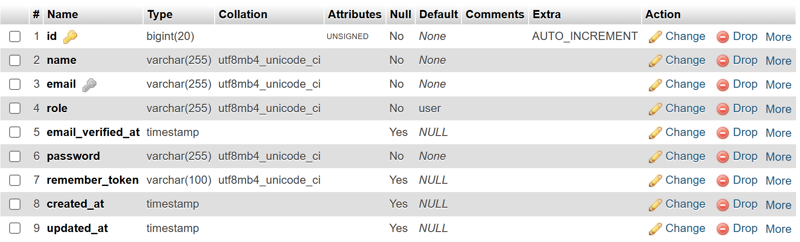

2. Screenshot isi tabel users yang menunjukkan:
   - minimal 1 user dengan role = admin
   - minimal 1 user dengan role = user
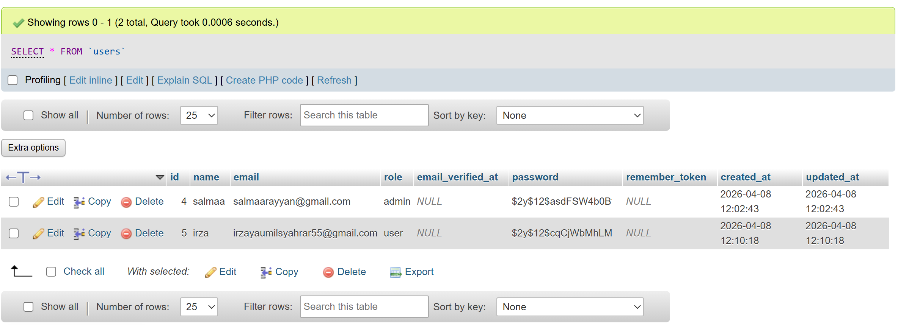

### 2. Role Tampil di Navigation Bar
1. Login sebagai admin, screenshot navbar yang menampilkan role admin.
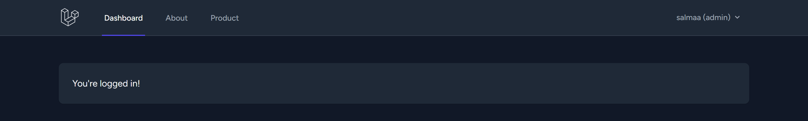

2. Login sebagai user biasa, screenshot navbar yang menampilkan role user.
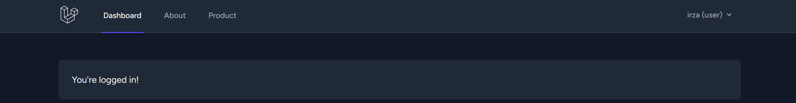

### 3. Gate export-product (UI)
1. Login sebagai admin, buka halaman Product, screenshot tombol Export terlihat.
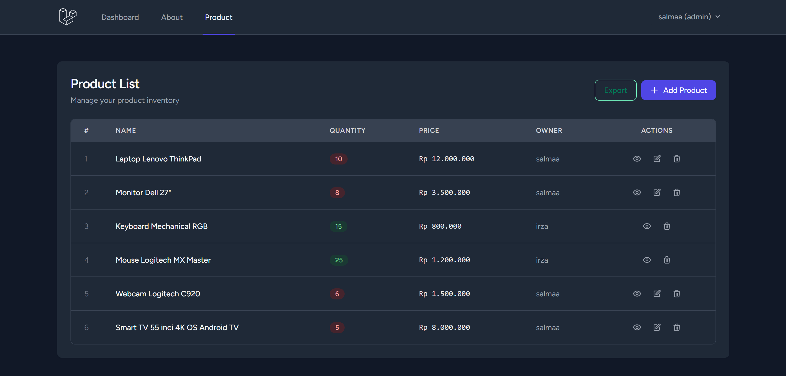

2. Login sebagai user biasa, buka halaman Product, screenshot tombol Export tidak terlihat.
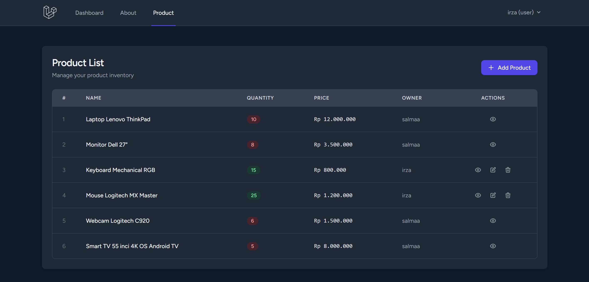

### 4. Gate export-product (Route Protection)
1. Login sebagai user biasa.
2. Akses URL export langsung (contoh: /product/export).
3. Screenshot hasil akses ditolak (403 / unauthorized).
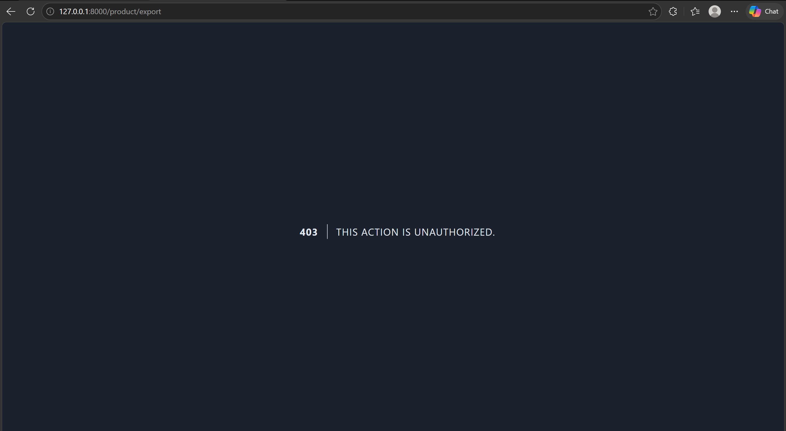

### 5. Policy Product - Update
1. Login sebagai user biasa.
2. Edit produk miliknya sendiri sampai berhasil.
3. Screenshot notifikasi sukses update.
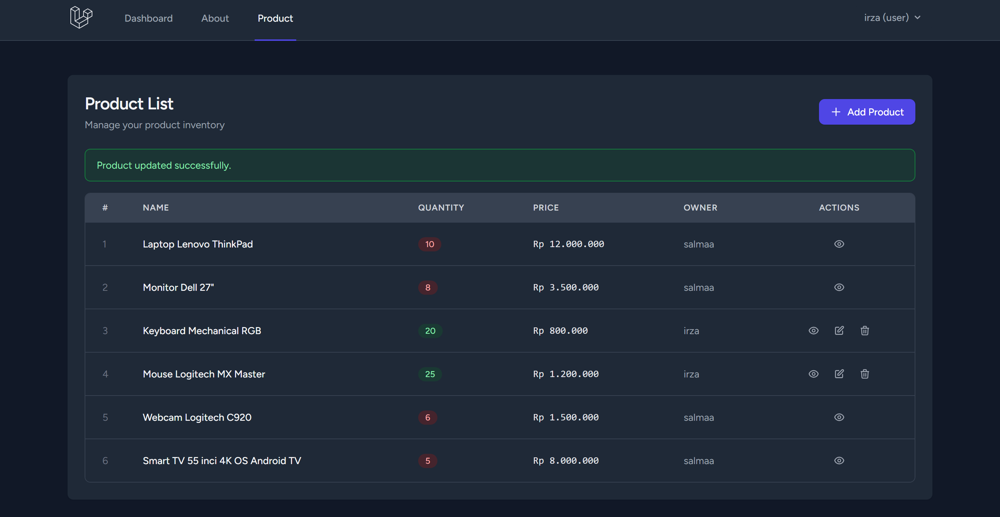

4. Coba akses edit produk milik user lain.
5. Screenshot hasil akses ditolak (403 / forbidden).
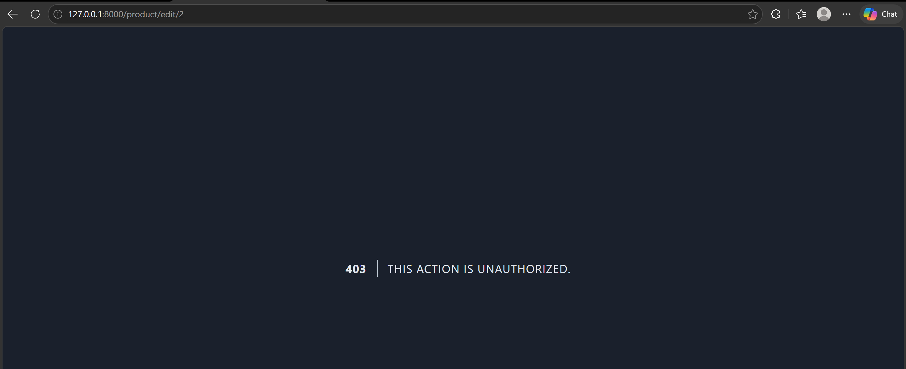

### 6. Policy Product - Delete
1. Login sebagai user biasa.
2. Coba hapus produk milik user lain.
3. Screenshot akses ditolak / tombol tidak tersedia.
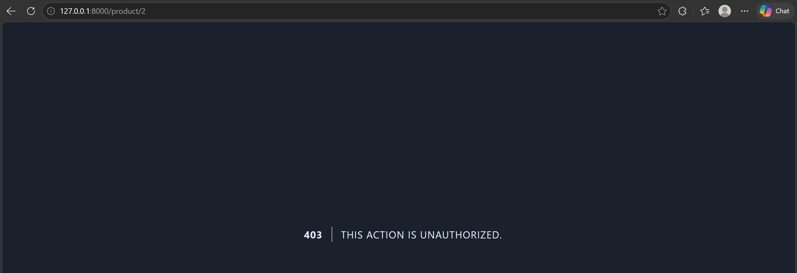

4. Login sebagai admin.
5. Hapus produk milik user lain.
6. Screenshot bukti berhasil hapus.
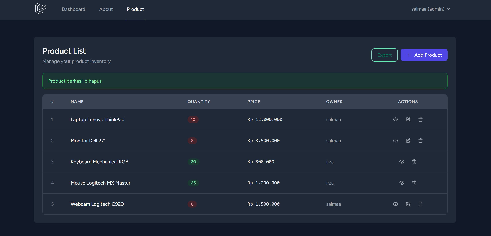

### 7. (Opsional, Nilai Tambah)
1. Login sebagai admin.
2. Klik Export.
3. Screenshot file CSV berhasil terunduh.
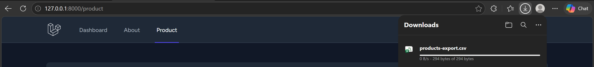