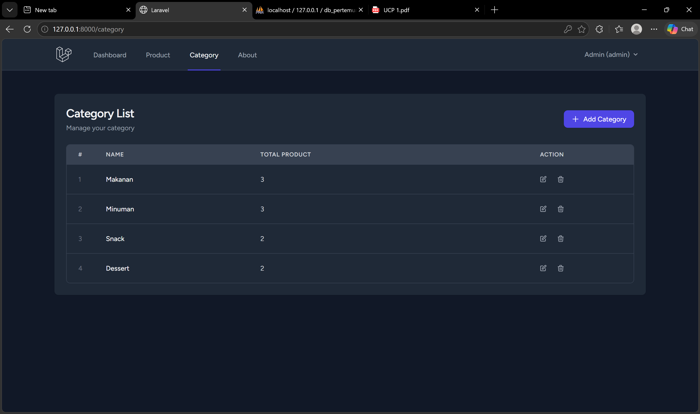
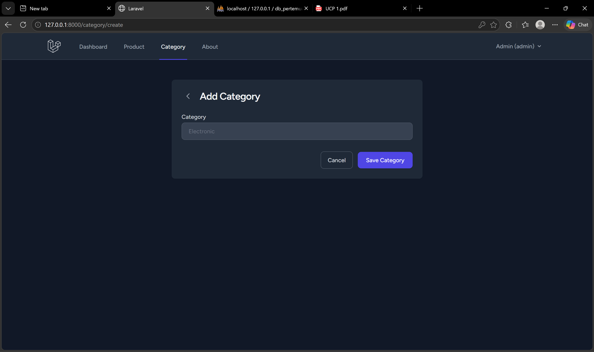
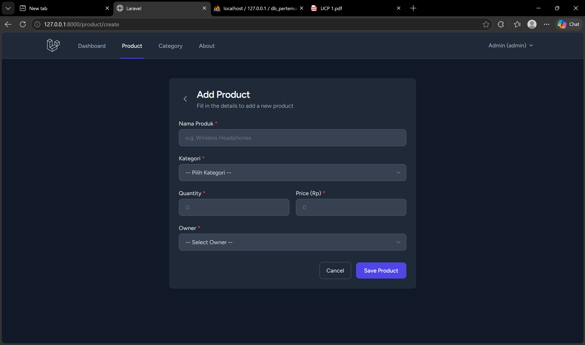
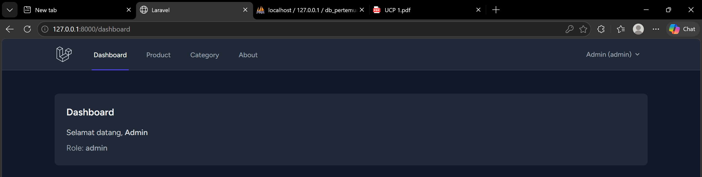
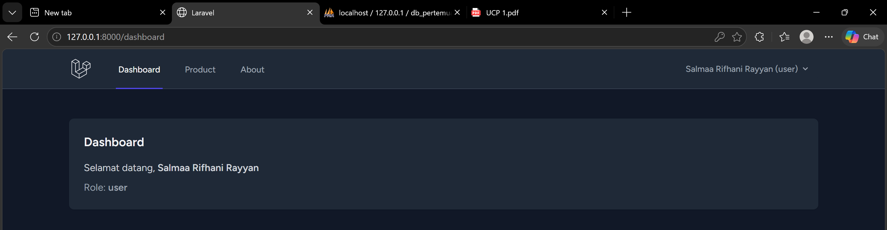

# UCP 1

## 1. Tabel Category (CRUD)

Halaman Category List menampilkan daftar kategori beserta jumlah total produk yang terhubung ke masing-masing kategori. Terdapat fitur Add, Edit, dan Delete category.

## 2. Tambah Category

Form untuk menambahkan category baru. Field yang diisi hanya nama category.

## 3. Tambah Produk dengan Relasi Category

Pada form Add Product, terdapat dropdown Kategori yang terhubung dengan tabel categories. User harus memilih kategori saat menambahkan produk baru.

## 4. Tampilan Admin

Saat login sebagai Admin, menu navigasi menampilkan Dashboard, Product, Category, dan About. Admin memiliki akses penuh ke semua fitur termasuk CRUD Category.

## 5. Tampilan User

Saat login sebagai User biasa, menu Category tidak muncul di navigasi. Hal ini diatur menggunakan Gate `manage-categories` yang hanya mengizinkan role admin untuk mengakses halaman Category.

