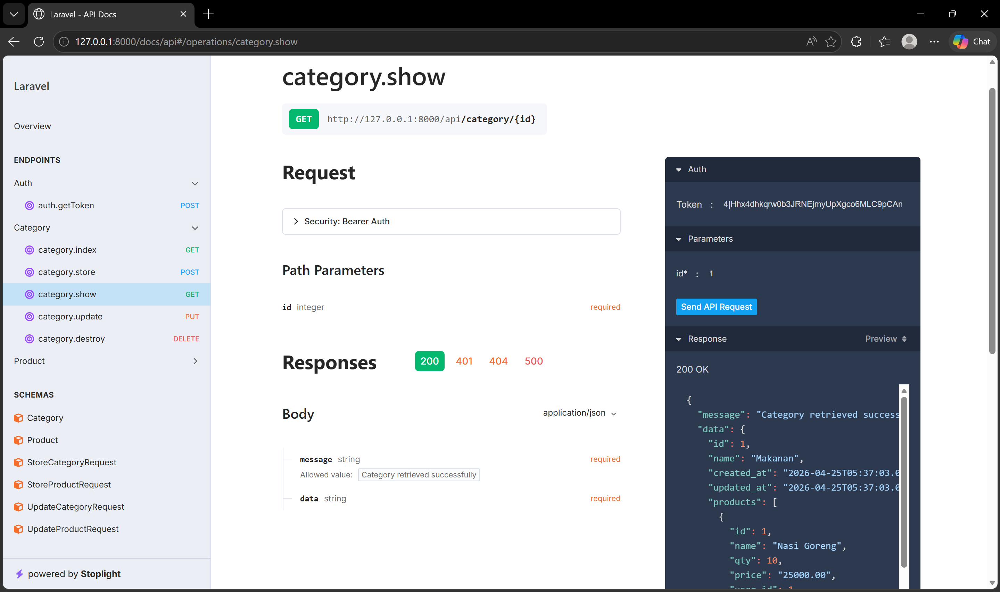
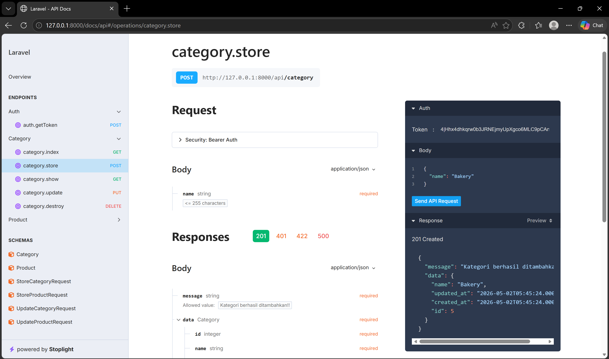
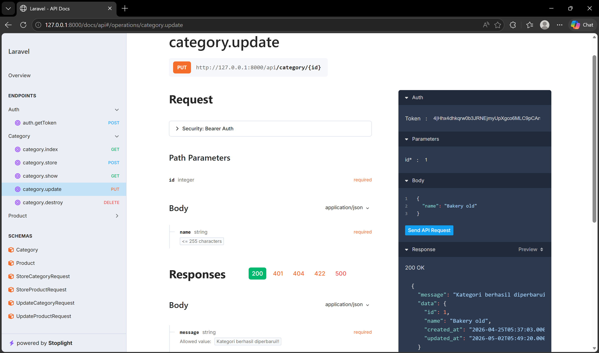
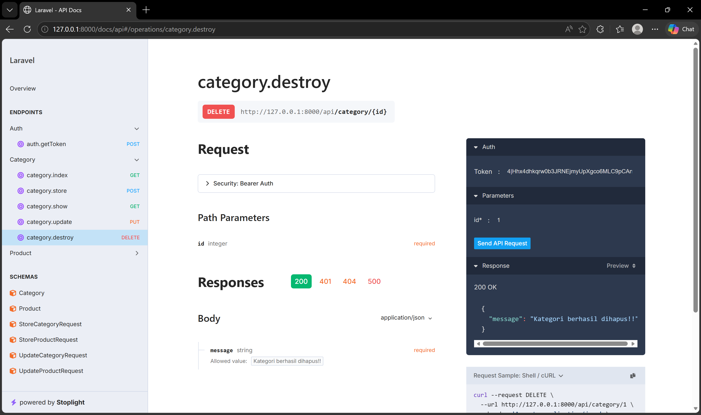
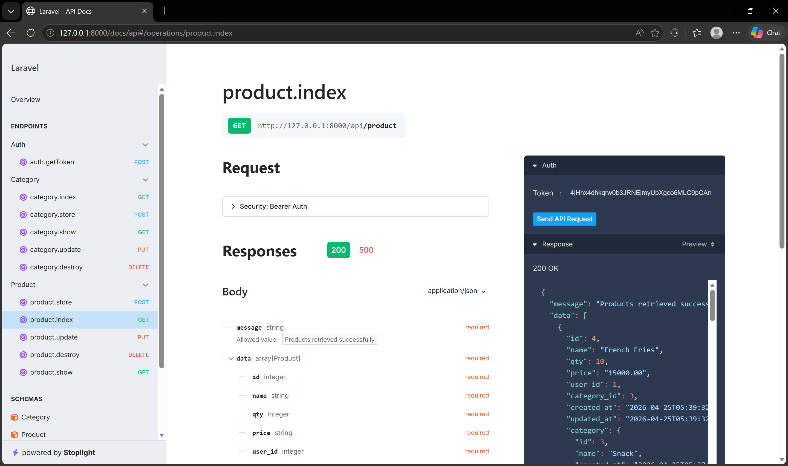
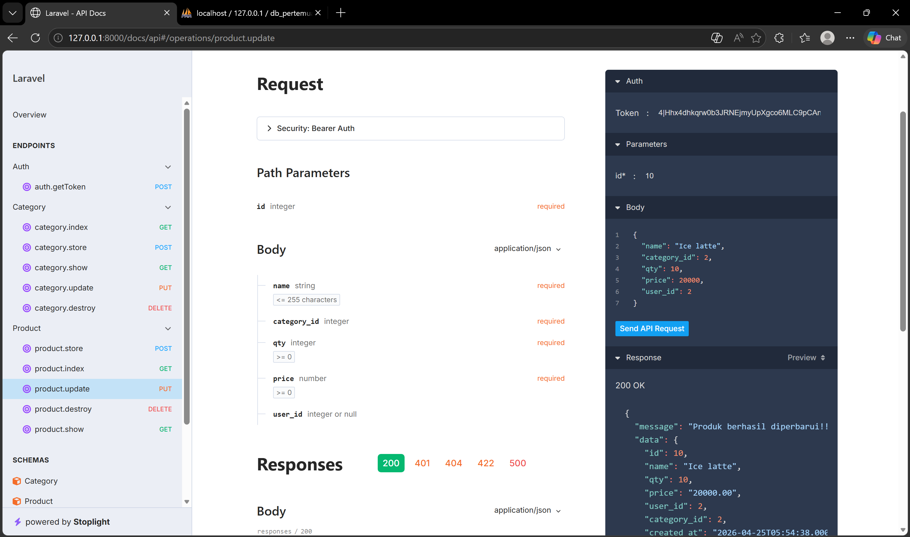
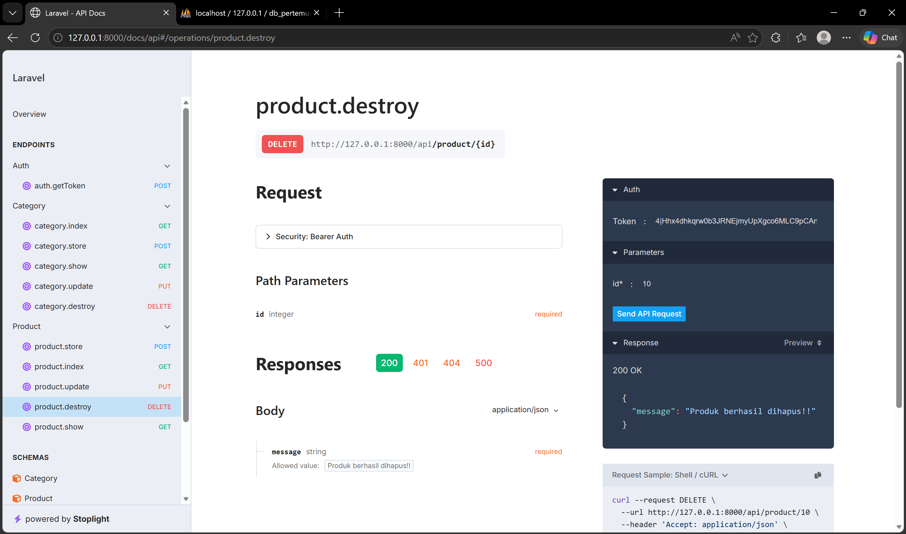

## Dokumentasi API Category

Base URL: http://127.0.0.1:8000

Semua endpoint Category membutuhkan token:

Header:

- Authorization: Bearer {token}
- Accept: application/json
- Content-Type: application/json

### 1) GET Category

Endpoint:

GET /api/category

Screenshot:



### 2) POST Category

Endpoint:

POST /api/category

Body JSON:

```json
{
	"name": "Bakery"
}
```

Screenshot:



### 3) PUT Category

Endpoint:

PUT /api/category/{id}

Body JSON:

```json
{
	"name": "Bakery old"
}
```

Screenshot:



### 4) DELETE Category

Endpoint:

DELETE /api/category/{id}

Screenshot:



## Dokumentasi API Product (GET, PUT, DELETE)

Base URL: http://127.0.0.1:8000

### 1) GET Product

Endpoint:

GET /api/product

atau

GET /api/product/{id}

Header (tanpa token):

- Accept: application/json

Screenshot:



### 2) PUT Product

Endpoint:

PUT /api/product/{id}

Header (wajib token):

- Authorization: Bearer {token}
- Accept: application/json
- Content-Type: application/json

Body JSON:

```json
{
	"name": "Ice latte",
	"category_id": 2,
	"quantity": 10,
	"price": 20000
}
```

Screenshot:



### 3) DELETE Product

Endpoint:

DELETE /api/product/{id}

Header (wajib token):

- Authorization: Bearer {token}
- Accept: application/json

Screenshot:

